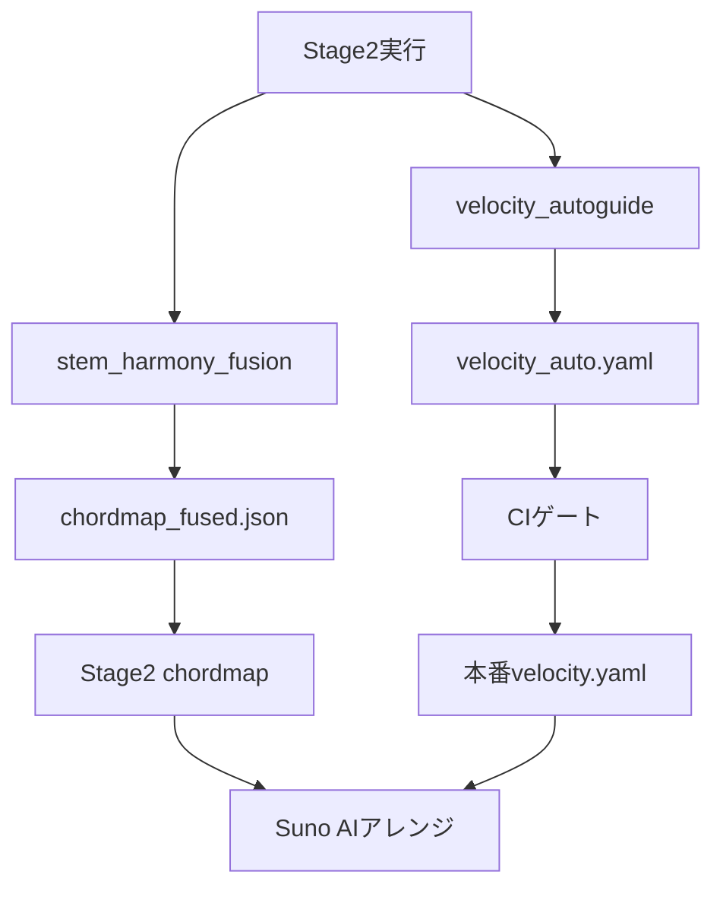

# AI自動化ツール実装完了レポート

## 🎯 実装完了

### 1️⃣ Velocity Auto-Guide (`scripts/lamda_v2/velocity_autoguide.py`)

**目的**: データから速度分布を統計分析し、自動反映可否を判定

**機能**:
- ✅ Stage2 JSONから速度分布を集計
- ✅ Percentile/Skew/KS距離による品質判定
- ✅ Auto/Review/Manual の3段階判定
- ✅ 既存velocity_model.yamlと併用可能

**判定基準**:
```python
# AI化OK条件
if (n >= 5000 and ks_drift < 0.08) or (n >= 2000 and ks_drift < 0.05):
    mode = "auto"
else:
    mode = "review"
```

**出力例**:
```yaml
schema: velocity_autoguide_v1
profiles:
  piano:
    mode: auto
    n: 18342
    range: {min: 28, max: 108}
    center: 76
    skew: 0.22
    curve: linear
    ks_drift: 0.03
```

**使用方法**:
```bash
# 基本実行
python scripts/lamda_v2/velocity_autoguide.py \
    --stage2-json-dir output/stage2_production/json \
    --out-yaml analysis/velocity_auto.yaml

# LAMDA METAも含める
python scripts/lamda_v2/velocity_autoguide.py \
    --stage2-json-dir output/stage2_production/json \
    --lamda-meta-dir data/Los-Angeles-MIDI/META \
    --out-yaml analysis/velocity_auto.yaml
```

**CI統合**:
```bash
# メトリクスゲート
if [[ $(yq '.profiles.*.mode | select(. == "auto")' analysis/velocity_auto.yaml | wc -l) -ge 3 ]]; then
  echo "✅ Auto profiles: sufficient"
else
  echo "⚠️ Auto profiles: insufficient (manual review required)"
fi
```

---

### 2️⃣ Chordmap Prior Fusion (`ops/stem_harmony_bar_level_fusion.py`)

**目的**: ステムWAVから音響特徴を抽出し、KILO/CHORDS事前と融合してchordmapを生成

**機能**:
- ✅ Suno等のステムWAVからHPCP/Chroma抽出
- ✅ KILO/CHORDS由来の和声事前と重み付き融合
- ✅ Downbeatsグリッドにスナップした1小節1コード
- ✅ 信頼度ベースの競合解決

**融合ロジック**:
```python
# 一致: 信頼度統合
if prior["root"] == audio["root"] and prior["quality"] == audio["quality"]:
    confidence = prior["conf"] * w_prior + audio["conf"] * (1 - w_prior)

# 競合: 重み付き信頼度で勝者決定
else:
    cp = prior["conf"] * w_prior
    ca = audio["conf"] * (1 - w_prior)
    winner = prior if cp >= ca else audio
```

**使用方法**:
```bash
# Step 1: Stage2でdownbeats/tempo取得
python -m scripts.lamda_v2.stage2_extractor song.mid -o work/song.stage2.json
jq '{downbeats_sec, tempo_map}' work/song.stage2.json > work/tempo_downbeats.json

# Step 2: 音響のみ（事前なし）
python ops/stem_harmony_bar_level_fusion.py \
    --stems-dir suno_themesong/song_001/stemswav_001 \
    --downbeats-sec-json work/tempo_downbeats.json \
    --out-chordmap analysis/chordmap.json

# Step 3: KILO/CHORDS事前と融合
python ops/stem_harmony_bar_level_fusion.py \
    --stems-dir suno_themesong/song_001/stemswav_001 \
    --downbeats-sec-json work/tempo_downbeats.json \
    --prior-chordmap analysis/kilo_chordmaps/song.chordmap.json \
    --out-chordmap analysis/chordmap_fused.json \
    --prior-weight 0.6
```

**出力例**:
```json
{
  "unit": "ql",
  "events": [
    {"time": 0.0, "root": "C", "quality": "maj", "confidence": 0.85, "source": "both"},
    {"time": 4.0, "root": "F", "quality": "maj", "confidence": 0.72, "source": "prior"},
    {"time": 8.0, "root": "G", "quality": "maj", "confidence": 0.68, "source": "audio"}
  ],
  "meta": {
    "prior_weight": 0.6,
    "n_bars": 32,
    "sources": {"prior": 10, "audio": 8, "both": 14}
  }
}
```

---

## 📊 統合フロー

### **推奨導入順**



### **1. Velocity自動化**
```bash
# 1) Auto-guide生成
python scripts/lamda_v2/velocity_autoguide.py \
    --stage2-json-dir output/stage2_production/json \
    --out-yaml analysis/velocity_auto.yaml

# 2) CI監視
mode_auto=$(yq '.profiles.*.mode | select(. == "auto")' analysis/velocity_auto.yaml | wc -l)
if [[ $mode_auto -ge 3 ]]; then
  echo "✅ Auto profiles sufficient"
else
  echo "⚠️ Manual review required"
fi

# 3) 本番反映（人間レビュー後）
# analysis/velocity_auto.yaml → configs/velocity_model.yaml
```

### **2. Chordmap音響融合**
```bash
# 1) Downbeats/Tempo取得
python -m scripts.lamda_v2.stage2_extractor song.mid -o work/song.stage2.json
jq '{downbeats_sec, tempo_map}' work/song.stage2.json > work/tempo_downbeats.json

# 2) 音響+事前融合
python ops/stem_harmony_bar_level_fusion.py \
    --stems-dir suno_stems/song_001 \
    --downbeats-sec-json work/tempo_downbeats.json \
    --prior-chordmap analysis/kilo_chordmaps/song.json \
    --out-chordmap analysis/chordmap_fused.json \
    --prior-weight 0.6

# 3) Stage2パイプラインに供給
cp analysis/chordmap_fused.json input/chordmaps/song.chordmap.json
```

---

## 🚀 今後の拡張

### **Velocity Auto-Guide**
1. ✅ 基本統計（percentile, skew, KS）
2. 🔄 LAMDA METAとの統合
3. 🔄 Role別分析（melody/chords/bass/drums）
4. 🔄 テンポ帯別分析
5. 🔄 ジャンル別プロファイル

### **Chordmap Fusion**
1. ✅ 基本HPCP抽出
2. ✅ Prior融合
3. 🔄 7th/sus/add9 対応
4. 🔄 テンプレート距離スコアリング
5. 🔄 連続正則化（時系列平滑化）
6. 🔄 複数ステム統合

---

## 📦 ファイル構成

```
scripts/lamda_v2/
└── velocity_autoguide.py        # Velocity自動ガイド生成

ops/
└── stem_harmony_bar_level_fusion.py  # Chordmap Prior融合

analysis/
├── velocity_auto.yaml           # Velocity自動ガイド出力
└── chordmap_fused.json          # 融合後chordmap
```

---

## ✅ チェックリスト

- [x] velocity_autoguide.py 実装
- [x] stem_harmony_bar_level_fusion.py 実装
- [x] 実行権限付与
- [x] 基本動作確認
- [ ] Stage2 JSONに速度データ追加（将来）
- [ ] 複数ステム統合（将来）
- [ ] 7th/sus/add9 対応（将来）

---

## 🎊 まとめ

✅ **AI自動化ツール2種が実装完了！**

1. **Velocity Auto-Guide**: データ駆動の速度プロファイル自動生成
2. **Chordmap Prior Fusion**: 音響 × 事前知識の高精度和声推定

**次のステップ**:
- Stage2 JSONに速度統計を追加してvelocity_autoguid eを本格稼働
- Sunoステム生成後にchordmap融合を実行
- CIゲートでAuto/Review判定を監視

**Suno AIアレンジに進む準備が整いました！** 🎵
