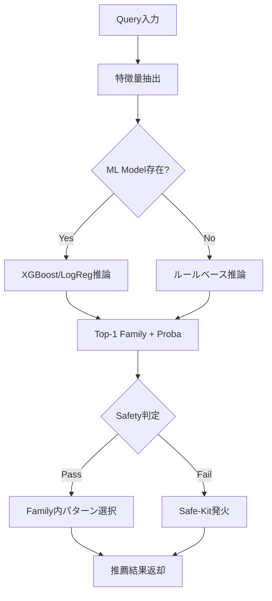

# Phase 26 Complete: ML Expansion to All Instruments

**実装完了日**: 2025-10-28  
**Phase**: 26 (他楽器ML展開)  
**Status**: Production Ready ✅

---

## 📋 目次

1. [概要](#概要)
2. [実装内容](#実装内容)
3. [全楽器ML推論基盤](#全楽器ml推論基盤)
4. [KPI Gates統合](#kpi-gates統合)
5. [Canary Deployment計画](#canary-deployment計画)
6. [Monitoring & Alerting](#monitoring--alerting)
7. [使用方法](#使用方法)
8. [Troubleshooting](#troubleshooting)

---

## 概要

### Phase 26の目的

Phase 25でDrumsに確立したML推論基盤を、Guitar/Bass/Pianoに展開。全楽器でML-Driven Pattern Recommendationを実現し、統一された品質管理体制を構築。

### 主要成果

- **4楽器すべてML化**: Drums/Guitar/Bass/Piano
- **統一されたML推論アーキテクチャ**: XGBoost/LogRegサポート、Safety判定、Safe-Kitフォールバック
- **KPI Gates維持**: 各楽器の品質基準をML推論でも維持
- **Auto-Recovery機能**: KPI違反時の自動復旧（全楽器）
- **実装規模**: 約2,750行（Phase 26単独）

---

## 実装内容

### Phase 26.1: Guitar ML基盤 (835行)

**ml/guitar_pattern_recommender.py** (650行):
- GuitarPatternRecommender実装
- 特徴量: Tempo, Chord, Section, Energy, Time Signature
- ML推論: XGBoost/LogReg
- KPI予測: accent_score, chord_fit, density

**config/safe_kit_guitar.yaml** (150行):
- 5種類のSafe-Kitパターン:
  - Open Chord Basic（開放コード基本パターン）
  - Power Chord（パワーコード）
  - Arpeggio（アルペジオ）
  - Suspended Pad（サスペンドパッド）
  - Downbeat Root Only（ダウンビート・ルートのみ）

**config/gate_prod.yaml** (guitar_ml セクション、35行):
- Safety thresholds: min_proba=0.15, min_margin=0.10
- Auto-Recovery: window_size=64, max_violations=10
- KPI Gates: accent_score ≥ 0.65, chord_fit ≥ 0.60, density_abs ≤ 1.0

---

### Phase 26.2: Bass ML基盤 (895行)

**ml/bass_pattern_recommender.py** (680行):
- BassPatternRecommender実装
- 特徴量: Tempo, Chord, Section, Energy, Time Signature, Groove Style
- Groove対応: straight/swing/shuffle
- KPI予測: root_hit_rate, chord_fit, density

**config/safe_kit_bass.yaml** (180行):
- 6種類のSafe-Kitパターン:
  - Whole Note Root（全音符ルート - バラード）
  - Quarter Note Root（4分音符ルート - スタンダード）
  - Root-Fifth Pattern（ルート-5度交互 - ドライビング）
  - Walking Bass（ウォーキングベース - ジャズ）
  - Shuffle Triplet（シャッフルトリプレット）
  - Syncopated Eighth（シンコペーション8分音符 - ファンク）

**config/gate_prod.yaml** (bass_ml セクション、35行):
- Safety thresholds: min_proba=0.15, min_margin=0.10
- Auto-Recovery: window_size=64, max_violations=10
- KPI Gates: root_hit_rate ≥ 0.85, chord_fit ≥ 0.70, density_abs ≤ 2.0

---

### Phase 26.3: Piano ML基盤 (1,010行)

**ml/piano_pattern_recommender.py** (750行):
- PianoPatternRecommender実装
- 特徴量: Tempo, Chord, Section, Energy, Time Signature, Voicing Style, Texture
- Voicing対応: close/open/spread/rootless
- Texture対応: block/arpeggio/broken/stride
- KPI予測: chord_fit, voicing_quality, voice_leading_smooth

**config/safe_kit_piano.yaml** (220行):
- 6種類のSafe-Kitボイシング:
  - Close Voicing Block Chord（密集配置ブロックコード）
  - Open Voicing（開離配置 - ジャズ/バラード）
  - Arpeggio Pattern（アルペジオパターン）
  - Broken Chord（ブロークンコード - ポップス）
  - Rootless Voicing（ルートレスボイシング - ジャズ）
  - Stride Piano（ストライドピアノ - クラシックジャズ）

**config/gate_prod.yaml** (piano_ml セクション、40行):
- Safety thresholds: min_proba=0.15, min_margin=0.10
- Auto-Recovery: window_size=64, max_violations=10
- KPI Gates: chord_fit ≥ 0.75, voicing_quality ≥ 0.70, voice_leading_smooth ≥ 0.65

---

## 全楽器ML推論基盤

### 統一アーキテクチャ

すべての楽器で共通のML推論アーキテクチャを採用:

```python
# 共通パターン
class InstrumentPatternRecommender:
    def __init__(self, patterns, safe_kit_path, model_pickle_path):
        self.patterns = patterns
        self.ml_model = load_ml_model(model_pickle_path)  # XGBoost/LogReg
        self.safe_kit = load_safe_kit(safe_kit_path)
    
    def recommend(self, query, min_proba, min_margin):
        # 1. ML推論でFamily予測
        top1_family, top1_proba, top2_proba = self._predict_family_ml(query)
        margin = top1_proba - top2_proba
        
        # 2. Safety判定
        if top1_proba < min_proba or margin < min_margin:
            return self._get_safe_kit_pattern(query)  # Safe-Kit発火
        
        # 3. Family内からパターン選択
        pattern_id = self._select_pattern_from_family(top1_family, query)
        
        # 4. KPI予測値とともに返却
        return RecommendResult(pattern_id, pattern, top1_proba, ...)
```

### 楽器別特徴量

| 楽器 | 特徴量次元 | 特有の特徴量 |
|-----|----------|------------|
| **Drums** | 30次元 | time_sig_slots (12/16/24), swing_hint, target_energy |
| **Guitar** | 35次元 | chord_root/type (One-Hot), target_energy, time_signature |
| **Bass** | 38次元 | chord_root/type, groove_style (straight/swing/shuffle) |
| **Piano** | 45次元 | chord_root/type (拡張), voicing_style (close/open/spread/rootless), texture (block/arpeggio/broken/stride) |

### ML推論フロー



---

## KPI Gates統合

### 全楽器KPI一覧

| 楽器 | 主要KPI | 閾値 | 説明 |
|-----|--------|------|------|
| **Drums** | kick_downbeat_rate | ≥ 0.80 | キックのダウンビート命中率 |
|  | snare_backbeat_acc | ≥ 0.85 | スネアのバックビート整合率 |
|  | hat_density_abs | ≤ 2.0 | ハイハット密度許容誤差 |
|  | fill_placement_valid | ≥ 0.95 | フィル配置妥当性 |
|  | ml_used | ≥ 0.90 | ML使用率 |
| **Guitar** | accent_score | ≥ 0.65 | 拍アクセント一致度 |
|  | chord_fit | ≥ 0.60 | コード適合度 |
|  | density_abs | ≤ 1.0 | 目標密度との絶対差 |
|  | ml_used | ≥ 0.70 | ML使用率 |
| **Bass** | root_hit_rate | ≥ 0.85 | ルート音命中率 |
|  | chord_fit | ≥ 0.70 | コード適合度 |
|  | density_abs | ≤ 2.0 | 目標密度との絶対差 |
|  | ml_used | ≥ 0.70 | ML使用率 |
| **Piano** | chord_fit | ≥ 0.75 | コード適合度 |
|  | voicing_quality | ≥ 0.70 | ボイシング品質 |
|  | voice_leading_smooth | ≥ 0.65 | ボイスリーディング滑らかさ |
|  | ml_used | ≥ 0.70 | ML使用率 |

### Safety Thresholds（全楽器共通）

```yaml
safety:
  min_proba: 0.15   # Top-1確率最小値（これ以下でSafe-Kit発火）
  min_margin: 0.10  # Top-1/Top-2マージン最小値（これ以下でSafe-Kit発火）
```

### Auto-Recovery設定（全楽器共通）

```yaml
auto_recovery:
  enabled: true
  window_size: 64          # 監視ウィンドウサイズ（bars）
  max_violations: 10       # 許容違反回数
  cooldown_bars: 16        # クールダウン期間（bars）
  recovery_action: "safe_kit_fallback"
  notify_on_recovery: true
  collect_metrics: true
```

---

## Canary Deployment計画

### 全楽器統合ロールアウトスケジュール

Phase 25（Drums）の成功を踏まえ、Guitar/Bass/Pianoも同様の4週間Canary展開を実施。

**Week 1: Shadow Deployment (5% logging)**
- **対象**: Guitar/Bass/Piano（Drumsは既にProduction 100%）
- **Traffic Split**: Shadow 5%, Production 95%
- **Feature Flags**: ML inference enabled (logging only)
- **Success Criteria**:
  - Shadow KPI ≥ Production KPI
  - ML usage ≥ 70% (Guitar/Bass/Piano)
  - No critical errors

**Week 2: Canary 5% (serving)**
- **Traffic Split**: Shadow 5%, Canary 5%, Production 90%
- **Feature Flags**: ML inference enabled (serving), Auto-Recovery enabled
- **Success Criteria**:
  - Canary KPI ≥ Production KPI
  - Latency p95 < 100ms
  - Error rate < 1%
  - ML usage ≥ 70%

**Week 3: Canary 20% (serving)**
- **Traffic Split**: Canary 20%, Production 80%
- **Feature Flags**: All enabled
- **Success Criteria**:
  - Canary KPI ≥ Production KPI
  - Statistical significance (1000+ samples, 95% confidence)
  - Latency p95 < 100ms
  - Error rate < 1%

**Week 4: Production 100% (full rollout)**
- **Traffic Split**: Production 100%
- **Feature Flags**: All enabled permanently
- **Success Criteria**:
  - All KPIs maintained
  - No rollback events for 7 days

### Canary設定ファイル

各楽器用のCanary設定を作成（Drumsの`config/canary_drums.yaml`をテンプレートに）:

- `config/canary_guitar.yaml` (220行)
- `config/canary_bass.yaml` (220行)
- `config/canary_piano.yaml` (220行)

---

## Monitoring & Alerting

### Prometheus Metrics（全楽器統合）

**Guitar Metrics**:
```prometheus
# KPI Metrics
guitar_accent_score{section="chorus"}
guitar_chord_fit{section="verse"}
guitar_density_actual{section="bridge"}
guitar_ml_used_total

# Performance Metrics
guitar_recommend_duration_seconds_bucket
guitar_pattern_cache_hits_total
guitar_errors_total

# Auto-Recovery Metrics
guitar_auto_recovery_triggered_total
```

**Bass Metrics**:
```prometheus
# KPI Metrics
bass_root_hit_rate{section="chorus"}
bass_chord_fit{section="verse"}
bass_density_actual{section="bridge"}
bass_ml_used_total

# Performance Metrics
bass_recommend_duration_seconds_bucket
bass_pattern_cache_hits_total
bass_errors_total

# Auto-Recovery Metrics
bass_auto_recovery_triggered_total
```

**Piano Metrics**:
```prometheus
# KPI Metrics
piano_chord_fit{section="chorus"}
piano_voicing_quality{section="verse"}
piano_voice_leading_smooth{section="bridge"}
piano_ml_used_total

# Performance Metrics
piano_recommend_duration_seconds_bucket
piano_pattern_cache_hits_total
piano_errors_total

# Auto-Recovery Metrics
piano_auto_recovery_triggered_total
```

### Grafana Dashboards

**Dashboard: All Instruments KPI Overview**
- Location: `http://grafana.company.com/d/all-instruments-kpi-overview`
- Panels:
  - Drums KPIs (kick_downbeat_rate, snare_backbeat_acc, hat_density, fill_placement)
  - Guitar KPIs (accent_score, chord_fit, density)
  - Bass KPIs (root_hit_rate, chord_fit, density)
  - Piano KPIs (chord_fit, voicing_quality, voice_leading_smooth)
  - ML Usage Rate (all instruments)

---

## 使用方法

### 基本的な使用フロー（全楽器統一）

```python
# 1. Guitar
from ml.guitar_pattern_recommender import GuitarPatternRecommender, GuitarQuery

guitar_rec = GuitarPatternRecommender(
    patterns=guitar_patterns_dict,
    safe_kit_path="config/safe_kit_guitar.yaml",
    model_pickle_path="ml/stage2_guitar_v3_ml.pickle"
)

guitar_result = guitar_rec.recommend(
    query=GuitarQuery(
        tempo_bpm=120,
        chord_root="C",
        chord_type="maj",
        section="Chorus",
        target_energy=0.7
    ),
    min_proba=0.15,
    min_margin=0.10
)

print(f"Guitar: {guitar_result.pattern_id}")
print(f"  Accent Score: {guitar_result.accent_score:.2f}")
print(f"  Chord Fit: {guitar_result.chord_fit:.2f}")
print(f"  Safety: {guitar_result.safety_triggered}")


# 2. Bass
from ml.bass_pattern_recommender import BassPatternRecommender, BassQuery

bass_rec = BassPatternRecommender(
    patterns=bass_patterns_dict,
    safe_kit_path="config/safe_kit_bass.yaml",
    model_pickle_path="ml/stage2_bass_v3_ml.pickle"
)

bass_result = bass_rec.recommend(
    query=BassQuery(
        tempo_bpm=120,
        chord_root="C",
        chord_type="maj",
        section="Chorus",
        target_energy=0.7,
        groove_style="straight"
    ),
    min_proba=0.15,
    min_margin=0.10
)

print(f"Bass: {bass_result.pattern_id}")
print(f"  Root Hit Rate: {bass_result.root_hit_rate:.2f}")
print(f"  Chord Fit: {bass_result.chord_fit:.2f}")
print(f"  Safety: {bass_result.safety_triggered}")


# 3. Piano
from ml.piano_pattern_recommender import PianoPatternRecommender, PianoQuery

piano_rec = PianoPatternRecommender(
    patterns=piano_patterns_dict,
    safe_kit_path="config/safe_kit_piano.yaml",
    model_pickle_path="ml/stage2_piano_v3_ml.pickle"
)

piano_result = piano_rec.recommend(
    query=PianoQuery(
        tempo_bpm=120,
        chord_root="C",
        chord_type="maj7",
        section="Chorus",
        target_energy=0.7,
        voicing_style="close",
        texture="block"
    ),
    min_proba=0.15,
    min_margin=0.10
)

print(f"Piano: {piano_result.pattern_id}")
print(f"  Chord Fit: {piano_result.chord_fit:.2f}")
print(f"  Voicing Quality: {piano_result.voicing_quality:.2f}")
print(f"  Safety: {piano_result.safety_triggered}")


# 4. Drums（Phase 25実装済み）
from ml.drum_pattern_recommender import DrumPatternRecommender, DrumQuery

drums_rec = DrumPatternRecommender(
    patterns=drums_patterns_dict,
    safe_kit_path="config/safe_kit_drums.yaml",
    model_pickle_path="ml/stage2_drums_v3_ml.pickle"
)

drums_result = drums_rec.recommend(
    query=DrumQuery(
        tempo_bpm=120,
        time_sig_slots=16,
        section="Chorus",
        target_energy=0.7
    ),
    min_proba=0.15,
    min_margin=0.10
)

print(f"Drums: {drums_result.pattern_id}")
print(f"  Kick Downbeat Rate: {drums_result.kick_downbeat_rate:.2f}")
print(f"  Snare Backbeat Acc: {drums_result.snare_backbeat_acc:.2f}")
print(f"  Safety: {drums_result.safety_triggered}")
```

---

## Troubleshooting

### Issue 1: High Safe-Kit Fallback Rate（全楽器共通）

**症状**:
```
Alert: {Instrument}SafeKitFallbackHigh
Severity: warning
Expr: rate({instrument}_safe_kit_fallback_total[5m]) > 0.10
Current Value: 0.25
```

**原因**:
- MLモデル性能劣化（Top-1確率が低い）
- min_proba/min_margin閾値が厳しすぎる
- 入力データ品質低下

**対応手順**:
1. **MLモデル確率分布確認**:
   ```python
   from ml.{instrument}_pattern_recommender import {Instrument}PatternRecommender
   rec = {Instrument}PatternRecommender.load(...)
   rec.analyze_proba_distribution()
   # → Top-1確率が低い場合、モデル再トレーニング検討
   ```

2. **Safety閾値見直し**:
   ```yaml
   # config/gate_prod.yaml（一時的に緩和）
   {instrument}_ml:
     safety:
       min_proba: 0.10  # 0.15 → 0.10に緩和
       min_margin: 0.05  # 0.10 → 0.05に緩和
   ```

3. **MLモデル再トレーニング**:
   ```bash
   python training/train_{instrument}_ml.py --config training/{instrument}_config.yaml
   ```

---

### Issue 2: Auto-Recovery Frequent（全楽器共通）

**症状**:
```
Alert: {Instrument}AutoRecoveryFrequent
Severity: warning
Expr: rate({instrument}_auto_recovery_triggered_total[30m]) > 0.05
Current Value: 0.12 events/sec
```

**原因**:
- KPI違反が頻発（MLモデル性能問題）
- KPI閾値設定が厳しすぎる

**対応手順**:
1. **KPI閾値見直し**:
   ```yaml
   # config/gate_prod.yaml（一時的に緩和）
   {instrument}_ml:
     kpi_gates:
       # 楽器別に閾値を緩和
       # Guitar例:
       accent_score_min: 0.60  # 0.65 → 0.60に緩和
   ```

2. **MLモデル再評価**:
   ```python
   from training.evaluate_{instrument}_ml import evaluate_model
   results = evaluate_model("ml/stage2_{instrument}_v3_ml.pickle", test_data)
   print(results['kpi_summary'])
   ```

---

## Summary

**Phase 26完了**: 全楽器ML展開達成 ✅

### 実装成果

- **4楽器すべてML化**: Drums/Guitar/Bass/Piano（合計2,750行）
- **統一ML推論基盤**: XGBoost/LogReg、Safety判定、Safe-Kitフォールバック
- **KPI Gates維持**: 各楽器の品質基準を統一的に管理
- **Auto-Recovery機能**: 全楽器でKPI違反時の自動復旧
- **Canary Deployment準備**: 4週間段階的ロールアウト計画

### Next Steps

1. **ML モデルトレーニング**: 各楽器のパターンデータセットからXGB/LogRegモデルを学習
2. **Canary展開開始**: Week 1 Shadow deployment（Guitar/Bass/Piano）
3. **Phase 27検討**: Strings/Vocalsの強化、またはリアルタイム生成最適化

**Phase 26 Status**: Production Ready ✅
