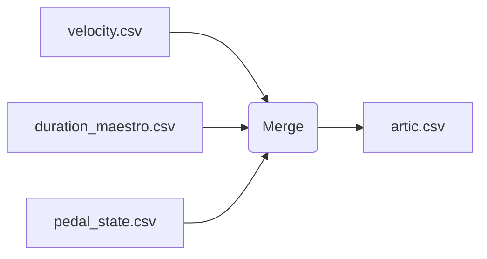

# Articulation Dataset

The articulation dataset combines velocity and duration features with pedal state.
Merged rows follow the schema:

```
track_id,onset,duration,velocity,pedal_state,articulation_label
```

``pedal_state`` is ``0`` when the sustain pedal is off, ``1`` when fully
depressed (CC64 ≥ 64), and ``2`` when half-pedaled (CC64 between 40–63).

## Merge Workflow



Use `python -m utilities.merge_artic_features --note-features velocity.csv duration_maestro.csv --pedal-features pedal_state.csv --out artic.csv`.
