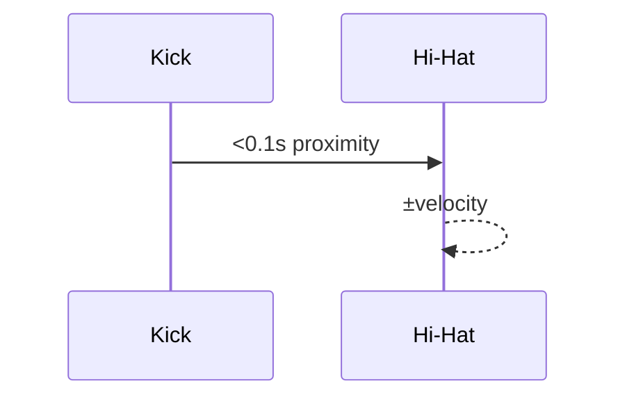

# Humanizer Reference

## `cyext.humanize.humanize_velocities`

```python
humanize_velocities(part_stream, amount=4,
                    use_expr_cc11=False,
                    use_aftertouch=False,
                    expr_curve="linear",
                    kick_leak_jitter=0)
```

- **expr_curve**: ``"linear"`` or ``"cubic-in"`` curve used when converting
  velocities to CC values. ``"cubic-in"`` emphasises softer notes.
- **kick_leak_jitter**: Random velocity range (default ``0``) applied to
  hi-hats when a kick occurs nearby. Values around ``2``–``5`` work well.


The helper :func:`utilities.humanizer.apply` exposes the same parameters and
passes them through to the Cython implementation when available.

## Late-Humanize


Enable with `--late-humanize <ms>` to push events a few milliseconds right
before output.

## Kick Leak Jitter



Use ``--kick-leak-jitter 3`` to randomise hi-hats whenever a kick is nearby.
Example CLI:

```bash
modcompose live model.pkl --late-humanize 6 --kick-leak-jitter 3
```

See [Live Tips](live_tips.md) for real-time usage examples.
