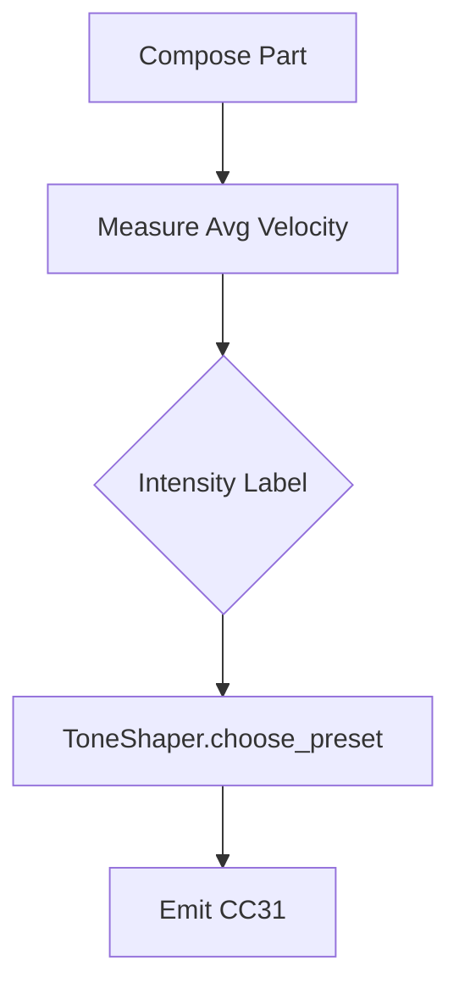
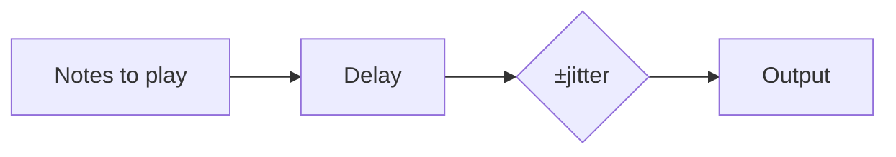

# Tone and Dynamics

This project can shape bass tone via MIDI control changes. The `ToneShaper`
selects an amp/cabinet preset depending on playing intensity. The chosen preset
is sent as CC#31 (amp type) and optional effect levels at the start of the part.
All control change events now use the keys ``cc`` and ``val`` instead of
``number`` and ``value``:

```python
{"cc": 11, "val": 100}
```

Example Python:

```python
from utilities.loudness_normalizer import normalize_wav

normalize_wav(Path("mix.wav"), section="chorus")
```

Key switch notes for articulations can be inserted with
`add_key_switches()` from `utilities.articulation_mapper`.

Velocity humanisation optionally maps note volumes to expression (CC11) and
channel aftertouch (CC74). Enable these with the global settings
`use_expr_cc11` and `use_aftertouch`.
When `use_expr_cc11` is ``True`` a CC11 message mirroring each note's velocity
is inserted. Setting `use_aftertouch` converts velocities to CC74 for devices
that interpret channel aftertouch as a timbre control.
You can enable these either programmatically:

```python
from utilities import humanizer

humanizer.set_cc_flags(True, True)
```

or by passing a mapping to ``humanizer.apply``:

```python
humanizer.apply(part, global_settings={"use_expr_cc11": True, "use_aftertouch": True})
```

Example YAML defining custom curves:

```yaml
# tone_curves.yml
expr_curve:
  cubic-in: [0, 1, 8, 27, 64, 125, 127]
aftertouch_curve:
  linear: [0, 21, 42, 64, 85, 106, 127]
```

Reference this file with ``--expr-curve`` or pass the mapping to
``humanizer.apply``.

## Using ``ToneShaper``

Measure the average note velocity of a part and feed the value to
``ToneShaper.choose_preset`` together with an intensity label.
Both values are combined to determine the preset. The returned preset is
converted to CC events (31/91/93/94) which should be inserted at
the start of the part.

```python
from utilities.tone_shaper import ToneShaper

shaper = ToneShaper()
preset = shaper.choose_preset(intensity="medium", avg_velocity=80.0)
part.extra_cc = shaper.to_cc_events(amp_name=preset, intensity="medium", as_dict=True)
```

A simplified decision flow:

```
mean velocity + intensity -> preset name
```

### Auto-Apply Flow



| Intensity | AvgVel <70 | AvgVel ≥70 |
|-----------|------------|-----------|
| low       | clean      | crunch    |
| medium    | crunch     | drive     |
| high      | drive      | fuzz      |

Example preset mapping file:

```yaml
presets:
  clean: {amp: 0}
  drive: {amp: 64, reverb: 40}
ir:
  clean: assets/irs/clean_ir.wav
  drive: assets/irs/drive_ir.wav
rules:
  clean: avg_vel<70
  drive: avg_vel>90 and intensity=='high'
```

Load with ``ToneShaper.from_yaml('amp.yml')``.

CC31 values:

| Preset | CC31 |
|--------|-----|
| clean  | 0   |
| crunch | 32  |
| drive  | 64  |
| fuzz   | 96  |

### Default Preset Mapping

| Intensity | AvgVel <70 | AvgVel ≥70 |
|-----------|------------|-----------|
| low       | clean      | crunch    |
| medium    | crunch     | drive     |
| high      | drive      | fuzz      |

## Loudness Normalisation

When rendering audio with ``modcompose render`` pass ``--normalize-lufs`` to
target a specific loudness level. The helper ``normalize_wav`` can infer a
target from the section name using ``{'verse': -16, 'chorus': -12}`` and
rewrites the WAV file in place:

```bash
modcompose render spec.yml --soundfont sf2 --normalize-lufs -14
```

```mermaid
flowchart LR
    A[Rendered WAV] --> B[measure_lufs()]
    B --> C{Section target?}
    C -- yes --> D[use mapping]
    C -- no --> E[use flag]
    D --> F(normalize_wav())
    E --> F
    F --> G[Write WAV]
```

## Automatic ToneShaper Learning

`ToneShaper.fit()` allows training a simple KNN classifier from MFCC features of your favourite presets. Pass a mapping of preset names to MFCC matrices:

```python
mfcc_clean = librosa.feature.mfcc(y=clean_wav, sr=sr)
mfcc_drive = librosa.feature.mfcc(y=drive_wav, sr=sr)
shaper.fit({"clean": mfcc_clean, "drive": mfcc_drive})
```

You can then call `predict_preset(mfcc)` to infer the closest preset.

## Late‑Humanize Jitter



Pass `--late-humanize-jitter <ms>` to add a random offset after the normal late-humanize delay.

## Real‑time Loudness HUD

Run the loudness meter to monitor output LUFS:

```bash
modcompose meter --device default
```

In live mode pass `--lufs-hud` to display the meter overlay.
