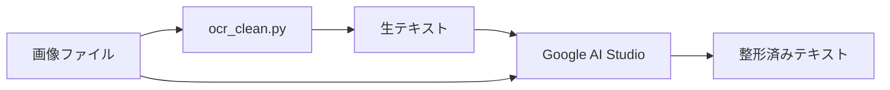

# OCR + 整形の推奨ワークフロー

## 概要

画像からの文字起こしは2段階で処理するのが最適:

1. **Stage 1: Python OCR** - 生の正確なテキスト抽出
2. **Stage 2: LLM整形** - 画像を見ながら文脈に基づく整形

## Stage 1: Python OCR（ocr_clean.py）

### 目的
- **正確な文字認識**のみに集中
- レイアウト破壊を避ける
- 生のテキストをそのまま出力

### 処理内容
```bash
python ocr_clean.py \
  --input-dir "画像フォルダ" \
  --output "生テキスト.txt" \
  --kyujitai-csv "旧字マップ.csv" \
  --blocklist "除外語.txt"
```

### 出力例
```
化物五十人力
蚊とんぼ玄二郎
「あいつ
足軽仲間で「蚊とんぼ玄二郎」と云えば有名である。 蚊とんぼのように小柄で痩っぽちで、蚊とんぼのように臆病
者だと云う意味なのである。
めしかか
飛騨国村岡藩、佐々木信濃守の国詰として、五両二人扶持で召抱えられたのが半年前。 組頭石川岩右衛門だけは、
...
```

### この段階での問題（未解決）
- ✅ 文字認識は正確
- ❌ ふりがな（めしかか、からめて）が混入
- ❌ 段落冒頭にスペース（全角空白）がない
- ❌ 短い台詞が本文に埋もれる可能性
- ⚠️ 旧漢字は基本的に変換済み（CSV辞書による）

## Stage 2: LLM整形（Google AI Studio / ChatGPT）

### 目的
- **画像とテキストを照合**しながら整形
- 文脈に基づく判断
- 小説としての体裁を整える

### 処理方法

#### Google AI Studio（推奨）

**プロンプト例:**
```
以下のOCRテキストを、添付した画像と照らし合わせながら整形してください。

【整形ルール】
1. ふりがな（ひらがなのみの行）を削除
   - 例：「めしかか」「からめて」「ふりかえ」など
   - ただし、台詞や本文の一部として意味がある場合は残す

2. 段落の冒頭に全角スペース（　）を追加
   - 会話文（「」で始まる行）は除く
   - 既にスペースがある場合は変更しない

3. 短い台詞の配置を確認
   - 画像を見て、台詞の位置が正しいか確認
   - 必要に応じて前後の文脈に合わせて配置

4. 旧漢字は新漢字に変換（既に大部分は変換済み）

5. 明らかな誤字・脱字は修正しない（原文尊重）

【OCRテキスト】
[ここに ocr_clean.py の出力を貼り付け]

【画像】
[ページ画像を添付]
```

#### ChatGPT（GPT-4V / GPT-4o）

同様のプロンプトで処理可能。ただし:
- 画像アップロード制限に注意
- 長文の場合は分割処理が必要

### 出力例
```
化物五十人力

蚊とんぼ玄二郎

　足軽仲間で「蚊とんぼ玄二郎」と云えば有名である。蚊とんぼのように小柄で痩っぽちで、蚊とんぼのように臆病者だと云う意味なのである。
　飛騨国村岡藩、佐々木信濃守の国詰として、五両二人扶持で召抱えられたのが半年前。組頭石川岩右衛門だけは、「彼奴どこかに見処がある」と云っていたが、誰一人としてそんな事を信用する者はなかった。
　楯野玄二郎、年は二十一歳、ちょいと見ると十八九にしか思えない、色白で痩形で、毎も気の好い笑顔をしていて、声ときたらまるで小娘のように優しいのである。気風の荒い寛永時代のことだから、こんな様子では「蚊とんぼ」などと馬鹿にされるのも当然であった。
...
```

## なぜLLMが必要か？

### Pythonツールでは不可能な処理

| 問題 | Pythonツール | LLM（マルチモーダル） |
|------|-------------|---------------------|
| **ふりがな判定** | 座標ベースで削除可能だが、誤削除のリスク大 | 画像と文脈から正確に判断 |
| **段落整形** | ルールベースで可能（句読点で判定） | 文脈を理解して自然に整形 |
| **台詞配置** | 座標のみ、文脈理解なし | 会話の流れを理解して配置 |
| **旧漢字変換** | 辞書ベースで対応可能 | 文脈に応じた適切な変換 |
| **誤字修正** | 不可能（辞書にない語を判断できない） | 文脈から推測可能 |

### LLMの優位性

1. **視覚情報と文字情報の統合**
   - 画像を見て「これはふりがな」「これは本文」を判断
   - レイアウトの意図を理解

2. **文脈理解**
   - 「はい」が台詞なのか、「はいる」の一部なのか判断
   - 会話の流れから台詞の位置を最適化

3. **柔軟な判断**
   - ルールに当てはまらない例外を処理
   - 文学的な表現を尊重

## 実践例：化物五十人力の処理

### Stage 1出力（ocr_clean.py）
```
「危い! 玄二郎さま」と悲しげに叫んだ、「この方に手出しをしてはいけません」
ひつこ
「そうだ、若造は引込んで居れ」
```

### Stage 2出力（LLM整形後）
```
「危い! 玄二郎さま」と悲しげに叫んだ、「この方に手出しをしてはいけません」
「そうだ、若造は引込んで居れ」
```

**削除されたもの:** `ひつこ`（ふりがな）

### 判断理由
- LLMは画像を見て「ひつこ」が「引込んで」のふりがなだと理解
- Pythonツールでは座標だけで判断→誤削除のリスク

## KenLMの役割（現状では限定的）

### 当初の期待
- 自然な語順への補正
- 文脈に基づく誤字修正

### 実際の問題
- Google Vision APIの出力は既に正確（語順は正しい）
- KenLMの補正が逆に語順を破壊してしまった

### 推奨
- **KenLMは使わない**（少なくとも現在のocr2novel_integrated.pyの実装では）
- 必要なら、LLM整形時にGoogle AI StudioやChatGPTに任せる

## 最終的なワークフロー



### ステップ

1. **OCR実行**
   ```bash
   python ocr_clean.py --input-dir "画像/" --output "生テキスト.txt"
   ```

2. **LLM整形**
   - Google AI Studioを開く
   - 画像と生テキストをアップロード
   - 整形プロンプトを入力
   - 整形済みテキストを取得

3. **最終確認**
   - 人間が最終チェック
   - 必要に応じて微調整

## まとめ

**Pythonツールの役割:**
- ✅ 正確な文字認識
- ✅ 基本的な旧漢字変換
- ❌ 文脈理解が必要な整形

**LLMの役割:**
- ✅ 画像とテキストの照合
- ✅ 文脈に基づく整形
- ✅ ふりがな・段落・台詞の適切な処理

**両者を組み合わせることで最高の結果が得られます。**

Pythonだけで完全自動化しようとすると、必ず文脈理解の壁にぶつかります。
画像を「見る」能力を持つマルチモーダルLLMの活用が鍵です。
